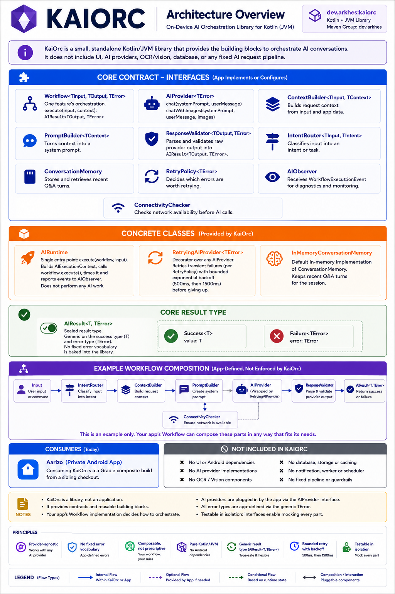

# KaiOrc — Kotlin-based AI Orchestrator

**KaiOrc** is a lightweight Kotlin library for AI workflow orchestration — provider abstraction, prompt pipelines, and structured execution — built for Kotlin/JVM and Kotlin Multiplatform-friendly codebases, with Android as its first real-world proving ground.

It answers one question: *how do you build sophisticated AI features without every feature reinventing its own request/response glue?*

```
Feature → Workflow → AIRuntime → AIProvider → Result
```

`AIRuntime` itself does no AI work — it coordinates. Everything else (which provider, what prompt, how to validate the reply, whether to retry) is a small, testable, swappable piece.

> **Status:** pre-1.0 (`0.1.2`), API not yet stable. Published to Maven Central as `io.github.arkhes-dev:kaiorc`. Extracted from and currently powering [Aarizo](https://github.com/arkhes-dev/Aarizo), a production Android app — not a green-field toy, but not yet hardened for arbitrary third-party use either.



---

## Table of Contents

- [Why KaiOrc](#why-kaiorc)
- [Design principles](#design-principles)
- [Installation](#installation)
- [Quick start](#quick-start)
- [Core concepts](#core-concepts)
- [Retry policy](#retry-policy)
- [Observability](#observability)
- [What KaiOrc deliberately doesn't do](#what-kaiorc-deliberately-doesnt-do)
- [Roadmap](#roadmap)
- [Contributing](#contributing)
- [License](#license)

---

## Why KaiOrc

Most AI-orchestration frameworks (LangGraph, CrewAI, Semantic Kernel, Spring AI, LlamaIndex) assume a backend-shaped world:

```
App → Backend → LangGraph / CrewAI / Semantic Kernel / ... → LLM
```

KaiOrc is for the shape that's left out of that picture:

```
App → KaiOrc → OpenRouter / OpenAI / Gemini / Anthropic / ...
```

There's no backend in this picture — because for a lot of real apps (mobile especially), there isn't one. KaiOrc is **serverless AI orchestration**: not serverless in the cloud-infrastructure sense, serverless from the *application's* perspective. The app talks straight to whichever LLM provider the user configured; KaiOrc's job is making that request/response path — retries, validation, context assembly, prompt composition — a reusable pipeline instead of copy-pasted glue in every feature.

## Design principles

- **BYOK-first** — the host app's users bring their own AI provider/key; KaiOrc never assumes a specific provider or a backend key vault.
- **Offline-first friendly** — AI is treated as an optional capability a host app can gate behind connectivity/configuration checks, not a hard dependency baked into the runtime.
- **Provider-agnostic** — `AIProvider` is a two-method seam (`chat`, `chatWithImages`); OpenRouter, OpenAI, Gemini, Claude, Azure, or a self-hosted gateway all look the same to a `Workflow`.
- **Coroutine-based** — no separate execution runtime, no thread pool of its own; everything is a `suspend fun`.
- **Workflow-driven** — reusable orchestration (`Workflow<TInput, TOutput, TError>`) instead of feature-specific request/response code duplicated per AI feature.
- **Host-owned errors** — `AIResult<T, TError>` is generic over the error type rather than a fixed enum, because a library can't presume its host's error vocabulary. A host fixes `TError` once to its own domain error type.
- **Minimal footprint** — pure Kotlin/JVM. No Android dependency, no bundled DI framework, no HTTP client. Classes carry plain `javax.inject` annotations so a host wires them into whatever DI container it already uses (Hilt, Dagger, Koin, or none at all).

## Installation

KaiOrc is published to Maven Central:

```kotlin
// app/build.gradle.kts
dependencies {
    implementation("io.github.arkhes-dev:kaiorc:0.1.2")
}
```

API docs: [javadoc.io/doc/io.github.arkhes-dev/kaiorc](https://javadoc.io/doc/io.github.arkhes-dev/kaiorc)

Developing KaiOrc and a consumer side by side? Use a **Gradle composite build** from a sibling checkout instead, so edits are picked up immediately with no publishing step:

```kotlin
// settings.gradle.kts
includeBuild("../KaiOrc")
```

```kotlin
// app/build.gradle.kts
dependencies {
    implementation("io.github.arkhes-dev:kaiorc:0.1.2")
}
```

Gradle resolves that dependency against the local KaiOrc checkout instead of Maven Central whenever `includeBuild` is present.

## Quick start

A minimal end-to-end example — one workflow that asks an LLM a question and returns the raw reply.

**1. Fix KaiOrc's generic error type to your own:**

```kotlin
sealed interface AppError {
    data object NotConfigured : AppError
    data object RateLimited : AppError
    data object NoInternet : AppError
    data class Unknown(val cause: Throwable?) : AppError
}

typealias AppResult<T> = AIResult<T, AppError>
```

**2. Implement `AIProvider` against your actual LLM client:**

```kotlin
class MyAIProvider(private val httpClient: MyLlmHttpClient) : AIProvider<AppError> {
    override suspend fun chat(systemPrompt: String, userMessage: String): AppResult<String> =
        try {
            AIResult.Success(httpClient.send(systemPrompt, userMessage))
        } catch (e: RateLimitException) {
            AIResult.Failure(AppError.RateLimited)
        } catch (e: Exception) {
            AIResult.Failure(AppError.Unknown(e))
        }

    override suspend fun chatWithImages(
        systemPrompt: String, userMessage: String, images: List<Pair<String, String>>
    ): AppResult<String> = TODO("vision request, same shape as chat()")
}
```

**3. Define a workflow:**

```kotlin
class AskQuestionWorkflow(private val provider: AIProvider<AppError>) : Workflow<String, String, AppError> {
    override val name = "ask-question"

    override suspend fun execute(input: String, context: AIExecutionContext): AppResult<String> =
        provider.chat(systemPrompt = "You are a helpful assistant.", userMessage = input)
}
```

**4. Run it through `AIRuntime`:**

```kotlin
val runtime = AIRuntime(observer = AIObserver { event -> println("${event.workflowName}: ${event.durationMs}ms, succeeded=${event.succeeded}") })
val workflow = AskQuestionWorkflow(MyAIProvider(httpClient))

when (val result = runtime.execute(workflow, "What's the capital of France?")) {
    is AIResult.Success -> println(result.value)
    is AIResult.Failure -> println("Failed: ${result.error}")
}
```

## Core concepts

| Type | Role |
|---|---|
| `Workflow<TInput, TOutput, TError>` | One reusable AI pipeline — the only thing a feature has to implement. |
| `AIRuntime` | The single entry point: `execute(workflow, input)`. Builds `AIExecutionContext`, runs the workflow, reports to `AIObserver`. Does no AI work itself. |
| `AIProvider<TError>` | The seam to "the AI" — `chat()` and `chatWithImages()`. One implementation per host app, wrapping whatever LLM client(s) it actually uses. |
| `ContextBuilder<TInput, TContext>` | Assembles the local data a workflow needs before prompting — the AI never queries a data source directly. |
| `PromptBuilder<TContext>` | Composes the final system prompt from a `ContextBuilder`'s output — one place prompt text is built, not scattered across call sites. |
| `ResponseValidator<TOutput, TError>` | Turns a raw AI reply into a trusted `TOutput`, or a typed `AIResult.Failure` — never let malformed/hallucinated output past this seam unchecked. |
| `IntentRouter<TInput, TIntent>` | Classifies raw input into an intent before a `Workflow` is chosen. Pure decision function — doesn't execute or know which workflow an intent maps to. |
| `ConversationMemory` | Short-term, session-scoped Q&A history (`InMemoryConversationMemory` ships built-in) so a workflow can resolve "it"/"them"-style follow-ups. |
| `AIResult<T, TError>` | `Success<T>` / `Failure<TError>` — what every seam above returns instead of throwing. |

## Retry policy

`RetryingAIProvider<TError>` wraps any `AIProvider<TError>` and retries a bounded number of times with backoff (500ms, then 1500ms) — but it doesn't decide *what's* retryable itself. You supply a `RetryPolicy<TError>`:

```kotlin
val retryPolicy = RetryPolicy<AppError> { it is AppError.RateLimited || it == AppError.NoInternet }
val retrying = RetryingAIProvider(delegate = MyAIProvider(httpClient), retryPolicy = retryPolicy)
```

Only errors your policy calls out get retried — everything else (bad credentials, a permanently rejected response) comes back immediately, since retrying can't help.

## Observability

`AIObserver` is a single-method `fun interface` — implement it however you already log (Logcat, a file, a metrics backend):

```kotlin
val observer = AIObserver { event ->
    Log.d("AI", "${event.workflowName} — ${if (event.succeeded) "ok" else "failed(${event.errorType})"} in ${event.durationMs}ms")
}
```

`AIRuntime` calls it after every `execute()` — name, duration, success/failure, and the failing error's simple class name. No workflow has to add its own logging.

## What KaiOrc deliberately doesn't do

- **No AI-based intent classification.** `IntentRouter` is a plain decision function — KaiOrc has no opinion on *how* you classify input (keyword rules, a small model, an LLM call). Bring your own.
- **No bundled HTTP/LLM client.** `AIProvider` is an interface; KaiOrc never makes a network call itself.
- **No bundled DI framework.** Classes carry `javax.inject` annotations for constructor injection, but KaiOrc doesn't require Hilt, Dagger, or any specific container.
- **No fixed error vocabulary.** See [Design principles](#design-principles) — `AIResult<T, TError>` stays generic on purpose.

## Roadmap

- [x] Extract from Aarizo into a standalone Kotlin/JVM module
- [x] Move to its own repository, independent build, independent history
- [x] Make the repository public
- [x] Publish to Maven Central under `io.github.arkhes-dev:kaiorc`
- [ ] Stabilize the public API surface (pre-1.0 breaking changes still possible)

## Contributing

KaiOrc is public but still pre-1.0, developed alongside [Aarizo](https://github.com/arkhes-dev/Aarizo) with breaking API changes still possible. See [CONTRIBUTING.md](CONTRIBUTING.md) for guidelines.

## License

[Apache License 2.0](LICENSE).
